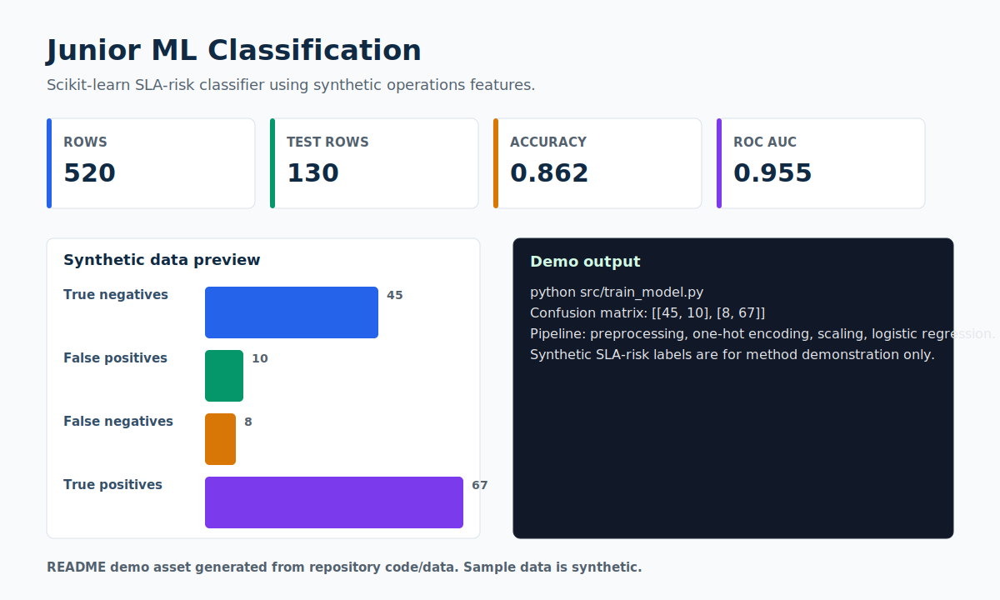

# Junior ML Classification

> A junior-friendly SLA-risk classifier using synthetic operations features.



## Recruiter Snapshot

| 30-second question | Answer |
| --- | --- |
| Problem | Operational risk can be framed as a supervised classification problem, but recruiters need to see the workflow and the limits clearly. |
| My role | I built the scikit-learn pipeline, selected interpretable features, evaluated classification metrics, and documented the synthetic-data boundary. |
| Result | The current run reports 0.862 accuracy and 0.955 ROC AUC on a 130-row synthetic test split. |
| Portfolio signal | Shows the transition from operations analysis to ML: features, labels, preprocessing, split strategy, and evaluation. |
| Data policy | All records are synthetic and safe for a public portfolio. |

## What I Built

- Train/test split stratified by synthetic SLA-risk label.
- ColumnTransformer with scaling and one-hot encoding.
- LogisticRegression pipeline with confusion matrix, classification report, and ROC AUC.

## Evidence In This Repo

- `src/train_model.py` contains the modeling workflow.
- `data/sample_synthetic_data.csv` contains 520 synthetic operations cases.
- `assets/demo.svg` summarizes the model output.

## Tools And Concepts

`Python`, `pandas`, `scikit-learn`, `classification`, `LogisticRegression`, `ROC AUC`

## Run Locally

```bash
python -m venv .venv
.venv\Scripts\activate
python -m pip install -r requirements.txt
python src/train_model.py
```

## Limitations

The target is synthetic. This project demonstrates method and communication, not a validated production risk model.

## Next Iteration

- Add cross-validation and threshold tuning.
- Add feature-importance or coefficient interpretation.
- Add a small model card with intended and non-intended use.

## Data Privacy

Every record, identifier, organization, person, scenario, and result in this project is synthetic unless explicitly marked otherwise. No employer, client, university, colleague, customer, credential, private path, or sensitive personal record is used.
